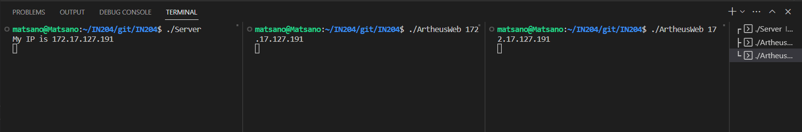
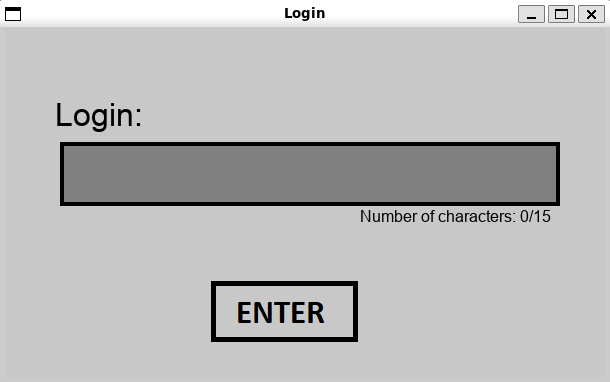
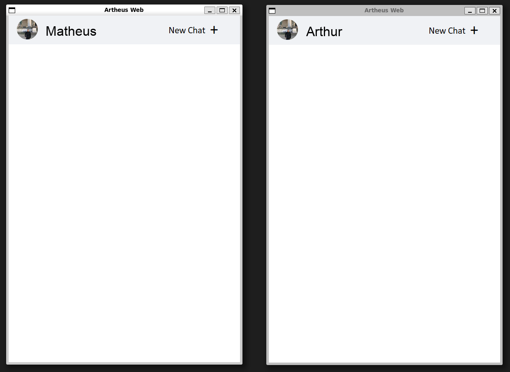
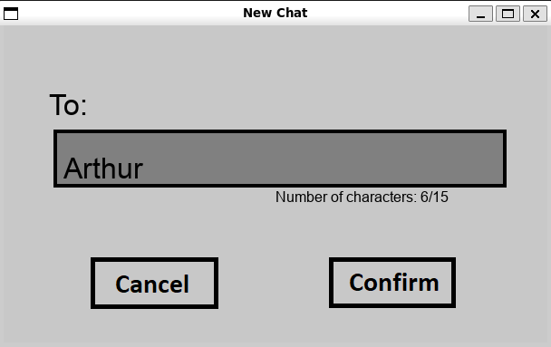
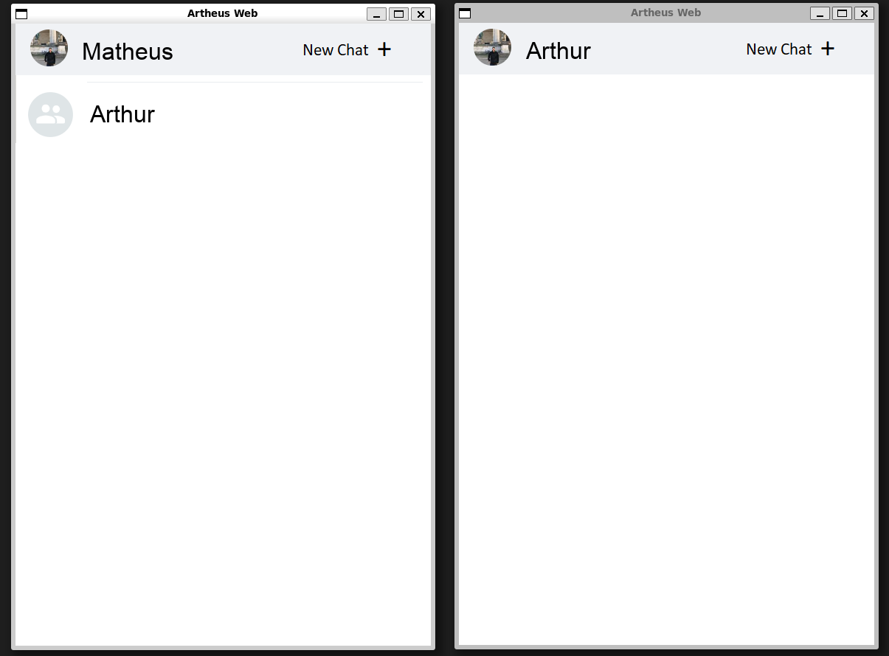
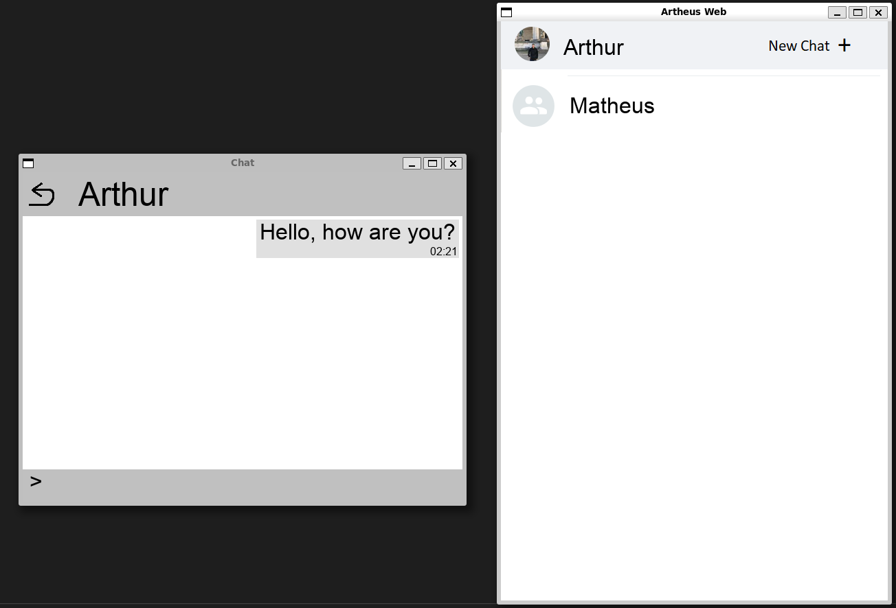
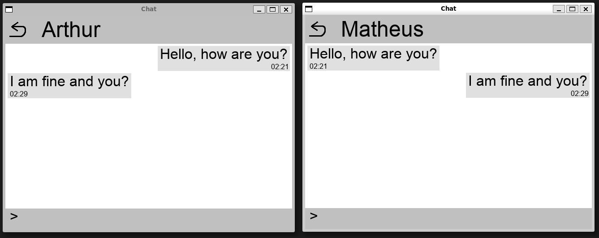
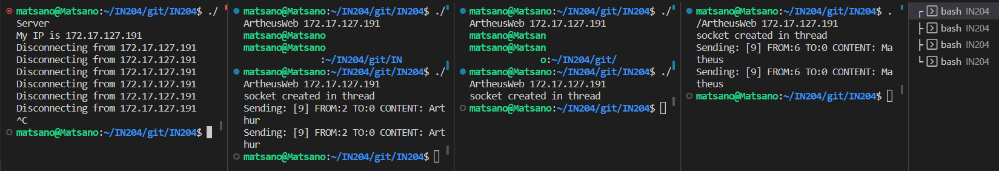

# PROJECT IN204 - Artheus Web
Final project in C++ for the Software Engineering and Object Oriented Programming course (IN204).

## Description
The program is a multi-user chat with a server through object-oriented programming.

## Installation

### 1) GitHub

Clone the repository with the following command:

```bash
git clone https://github.com/arthur-ruback/IN204.git
```

### 2) Requirements and Dependencies

- cmake
- SFML modules: network
- SDL2 modules: image, ttf

This project was developed and tested on Ubuntu 22.04. To install the dependencies on Linux, use the following commands:

```bash
sudo apt-get install libsdl2-dev libsdl2-image-dev libsdl2-ttf-dev libsfml-dev cmake make
```

## Compilation

To compile the project, run the following commands in IN204 directory:

```bash
cmake  CMakeLists.txt
make all
```

## Execution

The program consists of two executables, a server(Server) and a client(ArtheusWeb). After the server is up and running, the clients can be executed specifying the IPV4 adress of the server to directly connect to them as "./StateMachine 123.123.123.123"

The server prints its IP in the console to make it easier to connect to it.

To talk to other clients, no other IP except the server is required.

The name of the person you would like to talk to when creating a new chat is CASE SENSITIVE and if not specified correctly will not generate a new chat.

The step by step is shown below:

### 1) Server

Run the command below in a terminal:

```bash
./Server
```
The terminal will show an IP which will be used as parameter in "./ArtheusWeb", as shown below:

### 2) ArtheusWeb

In other two different terminals, run the command below:

```bash
./ArtheusWeb 172.17.127.191
```
WARNING: The number that will appear to you can be different from 172.17.127.191. You should use as parameter the number that appears in your terminal after "./Server".

Thus, there will be three terminals, as shown below. One terminal only to execute the server, another one to execute a client and the third one to execute the other client:



Once ArtheusWeb has been executed, the following window will appear and you can enter the name you want:


Once you have logged in to both clients, you will have two clients. As shown in the following image, one client is called Matheus and the other is called Arthur:


So that Matheus can send a message to Arthur, just click on New Chat in Matheus' window and write "Arthur".



WARNING: If you write a name that does not exist, you are not able to create a new chat. You first need to generate a new client in another terminal.

When you press enter or click in the button "Confirm", a new conversation will appear in Matheus' window. Just click on the conversation.


After writing and sending a message to Arthur by clicking enter, Arthur will receive a new conversation with Matheus in his window.


Arthur can answer Matheus by clicking on the chat. When sending the message, both chats are updated.


If a third client named Bruno wants to send a message to Matheus, it is necessary to run "./ArtheusWeb" in another terminal to generate a new client. And repeat the previous processes:


To end the program you must close all client windows, ending the execution of ArtheusWeb in all terminals.
And, later, ending the Server with ctrl+c.

## Authors

- Arthur COELHO RUBACK
- Matheus SANTOS SANO

We would like to thank our professor Mr. Bruno MONSUEZ for the knowledge taught in IN204 which were essential for the realization of this project.
